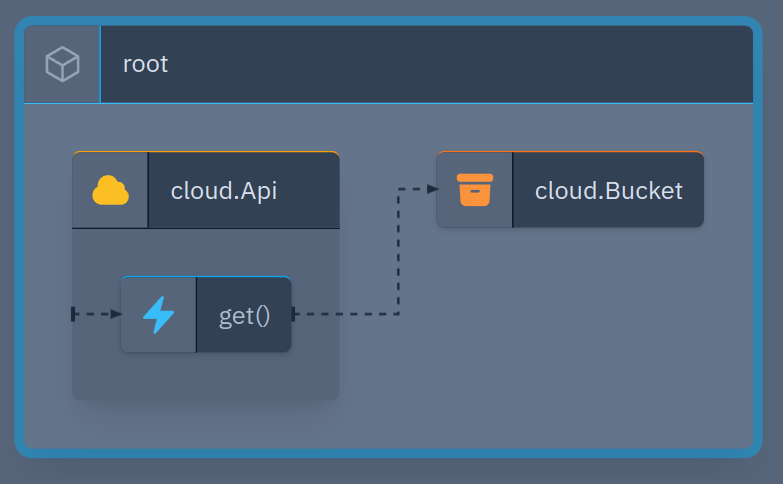

# Read file from bucket

This example shows how to read a file from a bucket using an API Gateway and a function.



## Infrastructure With Code

The infrastructure is composed by:

- A [cloud.Bucket](https://www.winglang.io/docs/standard-library/cloud/bucket#usage) to host the website
- A [cloud.Api](https://www.winglang.io/docs/standard-library/cloud/api) as proxy fetching file content
- A [inflight functions](https://www.winglang.io/docs/concepts/inflights) as glue functions for the API

The infrastructure is defined in the `main.w` file.

## Custom Resource

```wing
// 👇 We create a bucket with a file inside
let bucket = new cloud.Bucket();
bucket.addObject("file1.txt", "My file content!!");

// 👇 Here we have the Api Gateway
let api = new cloud.Api();

// 👇 Let's create an endpoint for HTTP get requests
api.get("/read-file/{fileName}", inflight (req: cloud.ApiRequest): cloud.ApiResponse => {

  // 👇 If the bucket do not contain the file name
  if (!items.contains(fileName)) {
    ... return bat response
  }

  // 👇 Otherwise we can safely read it
    ... return the content of the file
});
```

## Run Locally

```bash
wing it main.w
```